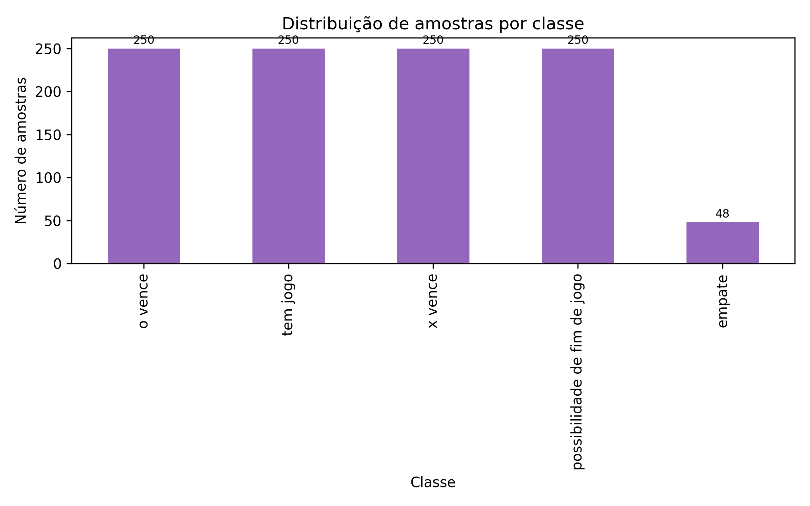

# IA-Jogo-da-velha

Repositório referente ao trabalho prático da disciplina de IA da PUCRS.

## Visão geral

O projeto treina e compara diferentes classificadores (k-NN, MLP, Árvore de Decisão e Random Forest) para avaliar estados de um tabuleiro de jogo da velha. A aplicação inclui uma API e um front-end que permite experimentar as previsões em tempo real e visualizar métricas de cada modelo.

## Dataset utilizado

- Arquivo: `tic_tac_toe_with_threats_and_draws.csv` (pasta raiz).
- Tamanho: 1 048 estados distintos após a leitura com cabeçalho (`header=0`).
- Atributos (9 colunas): cada posição do tabuleiro com valores `b` (vazio), `x` ou `o`.
- Rótulos possíveis:
    - `x vence`
    - `o vence`
    - `empate`
    - `tem jogo` (partida em andamento sem ameaça imediata)
    - `possibilidade de fim de jogo` (há ameaça iminente)
- Origem: combina o dataset clássico *Tic-Tac-Toe Endgame* da UCI com estados intermediários e empates criados manualmente para enriquecer a base.
- Pré-processamento: as colunas categóricas das casas são convertidas por label encoding (árvores/florestas) ou one-hot encoding seguido de padronização (k-NN/MLP).

### Distribuição das classes

| Classe                         | Amostras |
| ------------------------------ | -------- |
| `o vence`                      | 250      |
| `tem jogo`                     | 250      |
| `x vence`                      | 250      |
| `possibilidade de fim de jogo` | 250      |
| `empate`                       | 48       |



Para regenerar os gráficos de métricas e a distribuição das classes, execute:

```bash
/home/viniciusq/Documents/IA/IA-Jogo-da-velha/.venv/bin/python reports/plot_metrics.py
```

Os arquivos `.png` atualizados são salvos na pasta `reports/`.
